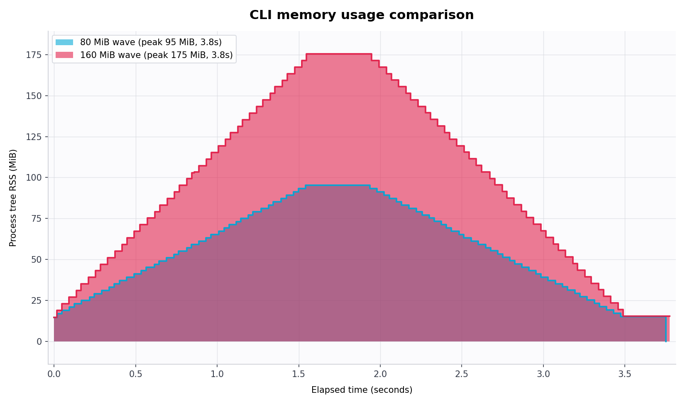

# memcurve

`memcurve` runs CLI commands one after another, samples each command's process-tree RSS memory, and writes an overlapped filled-area time-vs-memory plot.

The commands are run sequentially so the programs do not compete for memory. Each curve starts at elapsed time `0`, which makes the shapes directly comparable.



The preview is generated with a `0.005` second sampling interval.

## Install/run

```bash
uv run memcurve --help
```

For a local command while developing from this checkout:

```bash
uv tool install -e .
memcurve --help
```

## Example

```bash
uv run memcurve \
  --output memcurve.png \
  --open \
  --label small \
  --cmd "python3 -c 'import time; x=bytearray(35*1024*1024); time.sleep(0.8)'" \
  --label large \
  --cmd "python3 -c 'import time; x=bytearray(110*1024*1024); time.sleep(0.8)'"
```

By default command stdout is discarded, which keeps benchmark output from overwhelming the terminal. Use `--stdout inherit` to print program output, or `--stdout log` to write it under `<output-stem>_logs/`.

The sampling interval is configurable with `--interval <seconds>`. The default is `0.01`, meaning one sample every 10 ms.

The run also writes:

- `memcurve.csv`: sampled points for each curve
- `memcurve.json`: exit code, duration, peak RSS, and command metadata
